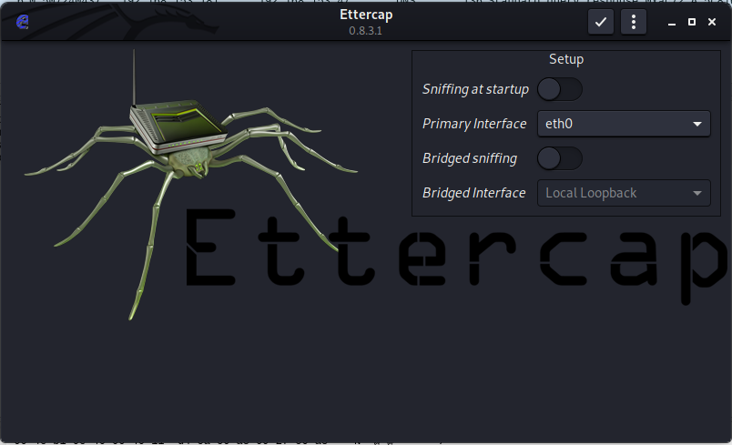
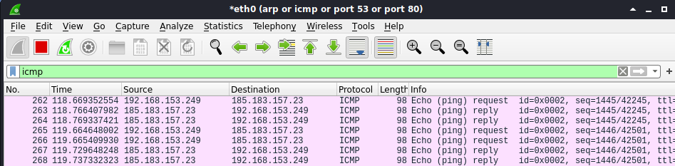
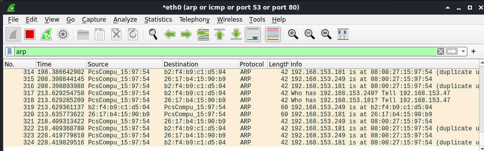
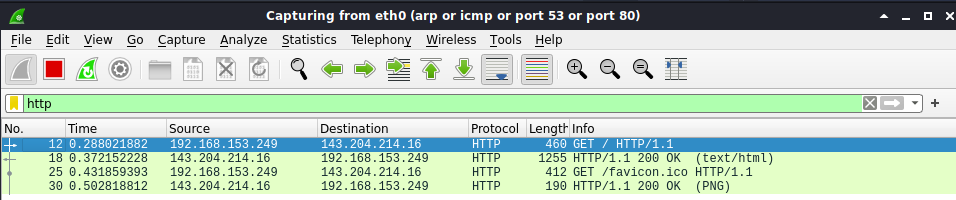
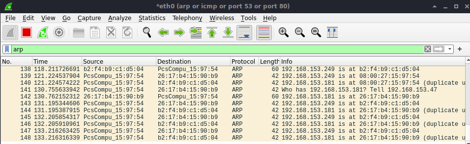

# Lab: ARP Poisoning Attacke

-   Zeitaufwand:        ⏱️⏱️
-   Schwierigkeitsgrad: 🌶️🌶️
-   Beschreibung: In diesem Lab führen Sie eine Machine-in-the-Middle (MITM) Attacke per ARP Poisoning durch und vertiefen so Ihr Verständtnis typischer Security-Probleme in einem LAN.

Am Ende dieses Labs sieht die Netzwerkkommunikation wie in folgendem Diagramm aus. Ihr Host-System und das Default Gateway wurden Opfer einer ARP Poisoning Attacke, die durch Ihre Kali VM durchgeführt wird. Sämtliche Kommunikation zwischen Default Gateway und Host werden über die Kali VM geleitet und können dort eingesehen und/oder manipuliert und/oder blockiert werden.

        +----------+
        |          |
        | Internet |
        |          |
        +-----^----+
              |
    +---------v-------+                         +------+
    |                 |  erwartete Verbindung   |      |
    | Default Gateway <- - - - - - - - - - - - -> Host |
    |                 |                         |      |
    +--------^--+-----+                         +-^--+-+
             |  |                                 |  |
             |  |                                 |  |
             |  |                                 |  |
             |  |                                 |  |
             |  |       effektive Verbindung      |  |
             |  |             +---------+         |  |
             |  +------------->         +---------+  |
             |                | Kali VM |            |
             +----------------+         <------------+
                              +---------+

-   DG.IP    entspricht der IP  Adresse des Default Gateways
-   DG.MAC   entspricht der MAC Adresse des Default Gateways
-   HOST.IP  entspricht der IP  Adresse des Host Systems
-   HOST.MAC entspricht der MAC Adresse des Host Systems
-   KALI.IP  entspricht der IP  Adresse der Kali VM
-   KALI.MAC entspricht der MAC Adresse der Kali VM

## Voraussetzung & Vorbereitung

-   Kali Linux mit Network Bridge Adapter Modus

## Aufgabe

Alle Konfigurationen betreffen Ihre Kali VM, weder Host noch Default Gateway müssen angepasst werden.

1.  Starten Sie auf Ihrem Host System ein Ping auf `hackingexposed.ch`. Ziel dieses Labs ist es, diese Pings in der Kali VM zu sehen. Prüfen Sie auch Ihre aktuelle ARP Tabelle Ihres Host Systems. Diese könnte etwa so aussehen:

    arp -n
    Address                  HWtype  HWaddress           Flags Mask            Iface
    DG.IP                    ether   DG.MAC              C                     eth0

Die ARP Tabelle in Kali sieht identisch aus.

2.  In diesem Setup fungiert die Kali VM als Router, Pakete mit Destination und Source IP Adresse ungleich jener der VM kommen an und müssen weitergeleitet werden. Damit Linux diese Pakete nicht verwirft sondern weiterleitet, muss `ip_forward` aktiviert sein, also den Wert `1` enthalten. Sie können das mittels `cat /proc/sys/net/ipv4/ip_forward` prüfen. Sollte der Wert gleich `0` sein, können Sie diesen mit dem Befehl `sudo echo 1 > /proc/sys/net/ipv4/ip_forward` auf `1` setzen.

3.  Starten Sie Wireshark in der Kali VM mit dem Capture Filter `arp or icmp or port 53 or port 80`.

4.  Starten Sie Ettercap (Start > 09 - Sniffing & Spoofing > ettercap-graphical), geben Sie das Passwort Ihres Users ein und **deaktivieren** Sie _Sniffing at startup_ und akzeptieren Sie die Einstellungen mit dem Haken oben rechts.

5.  Halten Sie Wireshark im Auge, während Sie _Scan for Hosts_ über das Lupensymbol starten.

6.  Über das Hostsymbol (rechts neben dem Lupensymbol) sollten Sie nun mindestens zwei Einträge haben: DG.IP und HOST.IP. Selektieren Sie DG.IP und fügen Sie diesen Eintrag zur Targetliste 1 mittels des Knopfs _Add to Target 1_ und selektieren Sie HOST.IP und fügen Sie diesen Eintrag zur Targetliste 2 hinzu. Über das Dreipunkte-Menu > Targets > Current targets können Sie Ihre Einstellung verifizieren.

7.  Starten Sie nun zuerst das _Sniffing_ mittels dem Playsymbol. Wie Sie feststellen, geschieht noch nichts in Wireshark.

8.  Wählen Sie nun über das Weltsymbol _MITM Menu_ den Eintrag _ARP Poisoning_ und OK. Nun sollten Sie in Wireshark die Ping Echo-Request und Response Ihres Host Systems sehen.

Ausserdem sehen Sie nun vermehrt ARP Pakete.

Die ARP Tabelle Ihres Host Systems könnte nun wie folgt aussehen:

    arp -n
    Address                  HWtype  HWaddress           Flags Mask            Iface
    DG.IP                    ether   KALI.MAC            C                     eth0
    KALI.IP                  ether   KALI.MAC            C                     eth0

Die ARP Tabelle Ihrer Kali VM könnte nun wie folgt aussehen:

    arp -n
    Address                  HWtype  HWaddress           Flags Mask            Iface
    HOST.IP                  ether   HOST.MAC            C                     eth0
    DG.IP                    ether   DG.MAC              C                     eth0

9.  Öffnen Sie in einem Browser auf Ihrem Host System die Website `http://neverssl.com/`.

10. Wenn Sie in Wireshark in Ihrer Kali VM mittels des Display Filters `http` filtern, sehen Sie die HTTP Kommunikation von Ihrem Host System zum Webserver im Internet.

11. Beenden Sie die MITM Attacke über das Stopsymbol _Stop MITM_ in Ethercap und halten Sie ein Auge auf die ARP Pakete in Wireshark, während Sie die Attacke stoppen.

12. Prüfen Sie nun die ARP Tabellen in Ihrem Host System und in Kali erneut.

Die ARP Tabelle Ihres Host Systems könnte nun wie folgt aussehen:

    arp -n
    Address                  HWtype  HWaddress           Flags Mask            Iface
    DG.IP                    ether   DG.MAC              C                     eth0
    KALI.IP                  ether   KALI.MAC            C                     eth0

Die ARP Tabelle Ihrer Kali VM könnte nun wie folgt aussehen:

    arp -n
    Address                  HWtype  HWaddress           Flags Mask            Iface
    HOST.IP                  ether   HOST.MAC            C                     eth0
    DG.IP                    ether   DG.MAC              C                     eth0

## Fragen

Alle Antworten per [Mail](mailto:pascal.knecht@juventus.schule?subject=[Lab]%20ARP%20Poisoning%20Attacke) mit Betreff `[Lab] ARP Poisoning Attacke` an den Dozenten.

1.  Was macht _Scan for Hosts_ in Aufgabe 5 genau? Kennen Sie dieses Verhalten und woher?

2.  In Aufgabe 11 sind die Pakete 139 und 143 aber auch 140 und 144 interessant. Was zeigen diese beiden Paket-Paare?

3.  Rekonstruieren Sie die tatsächlichen IP und MAC Adressen anhand der Screenshots aus diesem Lab. Gegeben ist die IP des Default Gateways und der Kali VM, gesucht sind die Adressen für:
    -   DG.IP    192.168.153.181
    -   DG.MAC   
    -   HOST.IP  
    -   HOST.MAC
    -   KALI.IP  192.168.153.47
    -   KALI.MAC

## Bemerkungen

-   Die effektivste Gegenmassnahme gegen MITM-Angriffe ist verschlüsselte Kommunikation.
