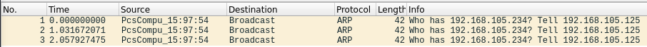
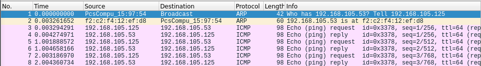
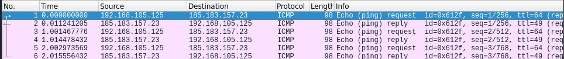

# Lab: ARP Tabelle

-   Zeitaufwand:        ⏱️
-   Schwierigkeitsgrad: 🌶️
-   Beschreibung: Dieses Lab behandelt die ARP Tabelle des Betriebssystems mit verschiedenen Netzwerk-Pings und Wireshark.

## Voraussetzung & Vorbereitung

-   Kali Linux mit Network Bridge Adapter Modus

## Aufgabe

1.  Öffnen Sie ein non-root Terminal (Alt + Enter) und schauen Sie mit `arp -n` die aktuelle ARP Tabelle an. Die Ausgabe sollte mindestens Ihr Default Gateway enthalten und etwa so ähnlich aussehen:

    arp -n
    Address                  HWtype  HWaddress           Flags Mask            Iface
    192.168.105.1            ether   d8:58:d7:00:8f:ca   C                     eth0

2.  Öffnen Sie Wireshark, wählen Sie das Interface `eth0` und den Capture Filter `arp or icmp` aus.

3.  Im Terminal setzen Sie nun einen Ping auf einen Host in Ihrem lokalen Netzwerk, den es garantiert nicht gibt mit `ping -c 3 192.168.105.234` ab.

    ping -c 3 192.168.105.234
    PING 192.168.105.234 (192.168.105.234) 56(84) bytes of data.
    From 192.168.105.125 icmp_seq=1 Destination Host Unreachable
    From 192.168.105.125 icmp_seq=2 Destination Host Unreachable
    From 192.168.105.125 icmp_seq=3 Destination Host Unreachable

    --- 192.168.105.234 ping statistics ---
    3 packets transmitted, 0 received, +3 errors, 100% packet loss, time 2045ms

Der Befehl `arp -n` hat nun einen unvollständigen Eintrag für diese IP Adresse:

    arp -n
    Address                  HWtype  HWaddress           Flags Mask            Iface
    192.168.105.234                  (incomplete)                              eth0
    192.168.105.1            ether   d8:58:d7:00:8f:ca   C                     eth0

4.  Wiederholen Sie Schritt 3 mit einem Gerät in Ihrem Netzwerk (bspw. Smartphone, TV, Musikanlage, NAS etc.):

    ping -c 3 192.168.105.53
    PING 192.168.105.53 (192.168.105.53) 56(84) bytes of data.
    64 bytes from 192.168.105.53: icmp_seq=1 ttl=64 time=4.36 ms
    64 bytes from 192.168.105.53: icmp_seq=2 ttl=64 time=2.83 ms
    64 bytes from 192.168.105.53: icmp_seq=3 ttl=64 time=1.23 ms

    --- 192.168.105.53 ping statistics ---
    3 packets transmitted, 3 received, 0% packet loss, time 2003ms
    rtt min/avg/max/mdev = 1.234/2.805/4.355/1.274 ms

Der Befehl `arp -n` hat nun einen unvollständigen Eintrag für diese IP Adresse:

    arp -n
    Address                  HWtype  HWaddress           Flags Mask            Iface
    192.168.105.53           ether   f2:c2:f4:12:ef:d8   C                     eth0
    192.168.105.234                  (incomplete)                              eth0
    192.168.105.1            ether   d8:58:d7:00:8f:ca   C                     eth0

5.  Wiederholen Sie Schritt 3 mit einem Host im Internet:

    ping -4 -c 3 hackingexposed.ch
    PING  (185.183.157.23) 56(84) bytes of data.
    64 bytes from ramses3.addere.ch (185.183.157.23): icmp_seq=1 ttl=49 time=11.3 ms
    64 bytes from ramses3.addere.ch (185.183.157.23): icmp_seq=2 ttl=49 time=13.1 ms
    64 bytes from ramses3.addere.ch (185.183.157.23): icmp_seq=3 ttl=49 time=12.7 ms

    ---  ping statistics ---
    3 packets transmitted, 3 received, 0% packet loss, time 2003ms
    rtt min/avg/max/mdev = 11.273/12.337/13.074/0.770 ms

Der Befehl `arp -n` hat nun einen unvollständigen Eintrag für diese IP Adresse:

    arp -n
    Address                  HWtype  HWaddress           Flags Mask            Iface
    192.168.105.53           ether   f2:c2:f4:12:ef:d8   C                     eth0
    192.168.105.234                  (incomplete)                              eth0
    192.168.105.1            ether   d8:58:d7:00:8f:ca   C                     eth0

## Fragen

Alle Antworten per [Mail](mailto:pascal.knecht@juventus.schule?subject=[Lab]%20ARP%20Tabelle) mit Betreff `[Lab] ARP Tabelle` an den Dozenten.

1.  In Aufgabe 3 werden drei ARP Pakete verschickt aber keine ICMP (Ping) Pakete. Wieso?

2.  Stimmt in Aufgabe 4 die Source MAC Adresse mit der Antwort im ARP Response Paket überein?

3.  Wieso gibt es in Aufgabe 5 keinen neuen Eintrag für die IP Adresse `185.183.157.23` in der ARP Tabelle?

## Bemerkungen

-   Falls Sie IPv6 haben, empfiehlt es sich für dieses Lab, Ping Pakete mit IPv4 (`-4`) zu verwenden. IPv6 verwendet kein ARP sondern [Neighbor Discovery Protocol](https://en.wikipedia.org/wiki/Neighbor_Discovery_Protocol) und funktioniert etwas anders.
