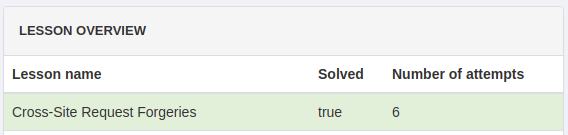

# Lab: Cross Site Request Forgeries (CSRF)

-   Zeitaufwand:        ⏱️⏱️
-   Schwierigkeitsgrad: 🌶🌶🌶️
-   Beschreibung: In diesem Lab festigen Sie Ihr Verständnis zum Thema Cross Site Request Forgeries (CSRF) anhand praktischer Übungen mit dem Projekt _WebGoat_, das Sie als Docker Container lokal starten.

WebGoat ist eine absichtlich unsichere Web Applikation, um praktische Erfahrungen mit Web Security sammeln zu können. Die Labs orientieren sich an den OWASP Top 10.

## Voraussetzung & Vorbereitung

-   Kali Linux
-   [WebGoat](https://github.com/WebGoat/WebGoat) als Docker Container

## Aufgabe

1.  Prüfen Sie, dass Docker installiert ist und als non-root User läuft. Der Befehl `docker ps` in einem non-root Terminal (Alt + Enter) sollte diese Ausgabe erzeugen:

    ```bash
    docker ps
    CONTAINER ID   IMAGE     COMMAND   CREATED   STATUS    PORTS     NAMES
    ```

2.  Starten Sie den WebGoat Docker Container: `docker run -p 8080:8080 -p 9090:9090 -e TZ=Europe/Zurich webgoat/goatandwolf`.

3.  Öffnen Sie mit dem Webbrowser Ihrer Wahl die URL `http://127.0.0.1:8080/WebGoat`. Sie sollten auf diese Anmeldemaske gelangen:

    

4.  Klicken Sie auf _Register new user_ und erstellen Sie für sich einen neuen User. Es handelt sich um einen lokalen User für WebGoat, mit dem Sie Ihren persönlichen Fortschritt in der Anwendung festhalten können.

5.  Nach erfolgreichem Login landen Sie auf der Übersichtsseite.

6.  Wechseln Sie nach [(A8:2013) Request Forgeries > Cross-Site Request Forgeries](http://127.0.0.1:8080/WebGoat/start.mvc#lesson/CSRF.lesson). Hier finden Sie 9 Lektionen, wobei die rot hinterlegten Lektionen den Fragen dieses Labs entsprechen.

    Die übrigen Lektionen helfen Ihnen, den Inhalt und die Idee von Cross Site Request Forgeries Attacken zu verstehen. Lesen Sie diese aufmerksam durch.

## Fragen

Alle Antworten per [Mail](mailto:pascal.knecht@juventus.schule?subject=[Lab]%20Cross%20Site%20Request%20Forgeries) mit Betreff `[Lab] Cross Site Request Forgeries` an den Dozenten.

1.  [Lektion 3](http://127.0.0.1:8080/WebGoat/start.mvc#lesson/CSRF.lesson/2): Mit welchem Exploit haben Sie diese Aufgabe gelöst? Erwartet wird HTML.

2.  [Lektion 4](http://127.0.0.1:8080/WebGoat/start.mvc#lesson/CSRF.lesson/3): Mit welchem Exploit haben Sie diese Aufgabe gelöst? Erwartet wird HTML.

3.  [Lektion 7](http://127.0.0.1:8080/WebGoat/start.mvc#lesson/CSRF.lesson/6): Mit welchem Exploit haben Sie diese Aufgabe gelöst? Erwartet wird HTML.

4.  [Lektion 8](http://127.0.0.1:8080/WebGoat/start.mvc#lesson/CSRF.lesson/7): Schicken Sie in Ihrem Mail einen Screenshot des _Report card_, auf welchem ersichtlich ist, dass Sie das CSRF Lab erfolgreich abgeschlossen haben.

    Ein Beispiel Screenshot:

    

## Bemerkungen

Sie können folgenden HTML Template Code verwenden, ersetzen Sie die `TODO`s und ergänzen Sie wo nötig:

```html
<html>
  <body>
    <form action="http://TODO" method="TODO">
      <!-- TODO -->
    </form>
    <script>
      document.forms[0].submit();
    </script>
  </body>
</html>
```
