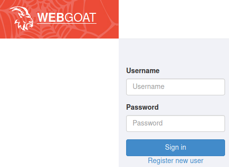
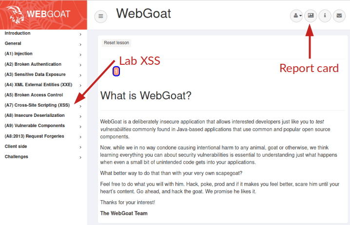
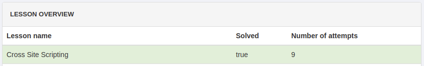

# Lab: Cross Site Scripting

-   Zeitaufwand:        ⏱️⏱️
-   Schwierigkeitsgrad: 🌶🌶🌶️
-   Beschreibung: In diesem Lab festigen Sie Ihr Verständnis zum Thema Cross Site Scripting (XSS) anhand praktischer Übungen mit dem Projekt _WebGoat_, das Sie als Docker Container lokal starten.

WebGoat ist eine absichtlich unsichere Web Applikation, um praktische Erfahrungen mit Web Security sammeln zu können. Die Labs orientieren sich an den OWASP Top 10.

## Voraussetzung & Vorbereitung

-   Kali Linux
-   [WebGoat](https://github.com/WebGoat/WebGoat) als Docker Container

## Aufgabe

1.  Prüfen Sie, dass Docker installiert ist und als non-root User läuft. Der Befehl `docker ps` in einem non-root Terminal (Alt + Enter) sollte diese Ausgabe erzeugen:

        docker ps
        CONTAINER ID   IMAGE     COMMAND   CREATED   STATUS    PORTS     NAMES

2.  Starten Sie den WebGoat Docker Container: `docker run -p 8080:8080 -p 9090:9090 -e TZ=Europe/Zurich webgoat/goatandwolf`.

3.  Öffnen Sie mit dem Webbrowser Ihrer Wahl die URL `http://127.0.0.1:8080/WebGoat`. Sie sollten auf diese Anmeldemaske gelangen:

    

4.  Klicken Sie auf _Register new user_ und erstellen Sie für sich einen neuen User. Es handelt sich um einen lokalen User für WebGoat, mit dem Sie Ihren persönlichen Fortschritt in der Anwendung festhalten können.

5.  Nach erfolgreichem Login landen Sie auf folgender Übersichtsseite.

    

    Die beiden roten Pfeile deuten die beiden wichtigen Bereiche für dieses Lab an:

    -   Report card: Hier sehen Sie Ihren persönlichen Fortschritt. Sie müssen für die Abgabe jeweils einen Screenshot des abgeschlossenen Labs schicken.

    -   Lab XSS: Sie arbeiten in diesem Lab das Kapitel _(A7) Cross-Site Scripting (XSS)_ durch.

6.  Wechseln Sie nach [(A7) Cross-Site Scripting (XSS)](http://127.0.0.1:8080/WebGoat/start.mvc#lesson/CrossSiteScripting.lesson). Hier finden Sie 12 Lektionen, wobei die rot hinterlegten Lektionen den Fragen dieses Labs entsprechen.

    Die übrigen Lektionen helfen Ihnen, den Inhalt und die Idee von Cross Site Scripting Attacken zu verstehen. Lesen Sie diese aufmerksam durch.

## Fragen

Alle Antworten per [Mail](mailto:pascal.knecht@juventus.schule?subject=[Lab]%20Cross%20Site%20Scripting) mit Betreff `[Lab] Cross Site Scripting` an den Dozenten.

1.  [Lektion 2](http://127.0.0.1:8080/WebGoat/start.mvc#lesson/CrossSiteScripting.lesson/1): Waren die Cookies in beiden Tabs dieselben?

2.  [Lektion 7](http://127.0.0.1:8080/WebGoat/start.mvc#lesson/CrossSiteScripting.lesson/6): Welches Feld ist angreifbar und wie haben Sie das herausgefunden?

3.  [Lektion 10](http://127.0.0.1:8080/WebGoat/start.mvc#lesson/CrossSiteScripting.lesson/9): Wie lautet die Route für den Test Code?

4.  [Lektion 11](http://127.0.0.1:8080/WebGoat/start.mvc#lesson/CrossSiteScripting.lesson/10): Wie kann diese Schwachstelle ausgenutzt werden? Verlangt ist eine funktionierende URL mit dem Exploit.

5.  [Lektion 12](http://127.0.0.1:8080/WebGoat/start.mvc#lesson/CrossSiteScripting.lesson/11): Beantworten Sie die Fragen. Schicken Sie in Ihrem Mail einen Screenshot des _Report card_, auf welchem ersichtilch ist, dass Sie das XSS Lab erfolgreich abgeschlossen haben.

    Ein Beispiel Screenshot:

    
