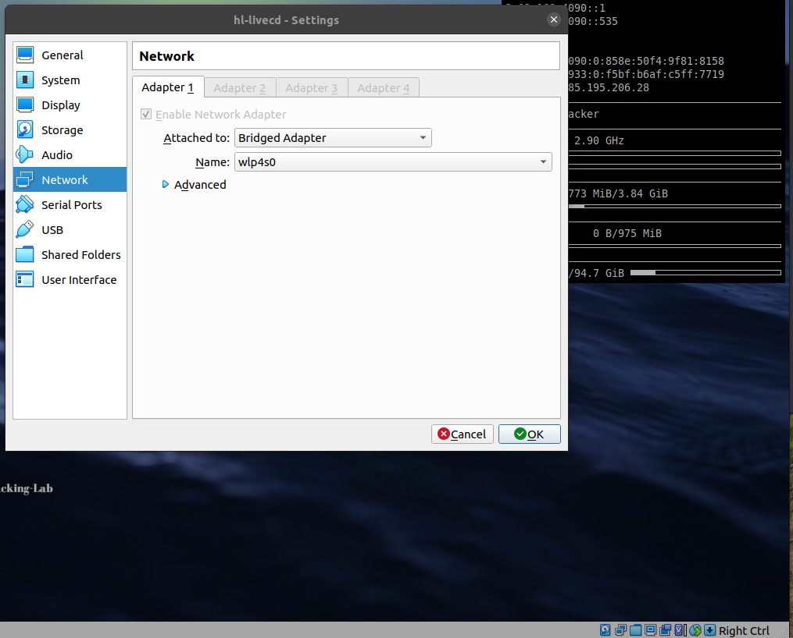

# Lab: Kali Setup

-   Zeitaufwand:        ⏱️⏱️
-   Schwierigkeitsgrad: 🌶️
-   Beschreibung: In diesem Lab setzen Sie Ihre Infrastruktur für alle folgenden Labs auf. Wir verwenden dazu die Linux Distribution Kali, die Sie als Live System mit VirtualBox auf Ihrem Notebook installieren.

## Voraussetzung & Vorbereitung

-   Notebook
-   VirtualBox

## Aufgabe

1.  Laden Sie die OVA-Datei `hl-livecd.ova` [hier](https://livecd.hacking-lab.com/largefiles/livecd/daily/hl-livecd.ova) (ca. 7 GB) herunter.

2.  Folgen Sie der Installationsanleitung [hier](https://github.com/Hacking-Lab/hl-livecd/blob/master/guides/install-livecd-de.md) und deployen Sie das Live System (ca. 20 GB).

3.  Stellen Sie die Netzwerkeinstellung Ihres Netzwerkadapters von `NAT` auf `Bridged Adapter` um, sodass Sie im Kali Linux Gastsystem eine IP Adresse Ihres lokalen DHCP Server erhalten.

    

4.  Lesen Sie die Datei `livecd.(pdf|md)` auf dem Desktop.

5.  Machen Sie sich mit der Live Linux Distribution vertraut, stöbern Sie etwas rum.

## Fragen

Alle Antworten per [Mail](mailto:pascal.knecht@juventus.schule?subject=[Lab]%20Kali%20Setup) mit Betreff `[Lab] Kali Linux` an den Dozenten.

1.  Wie lautet der Login Username?

2.  Wie lautet das Login Passwort?

3.  Welche Key Board Layouts stehen über das entsprechende Tool im Menu `00 - About` zur Verfügung?

4.  Was ist das Ergebnis/die Antwort, wenn sie ein _non-root_ Terminal öffnen und den Befehl `whoami` eingeben?

## Bemerkungen

-   Den Punkt _VPN_ in der Installationsanleitung können Sie ignorieren.

-   Falls Sie zu wenig internen Speicherplatz haben, können Sie sowohl das Image als auch das deployte OVA auf einem externen Datenträger wie beispielsweise einer SD Karte oder einer externen SSD per USB auslagern.

-   Diese Kali Linux Live CD können Sie nicht nur für diesen Unterricht verwenden sondern auch in den [Labs und Capture the Flags (CTF) von Hacking-Lab](https://www.hacking-lab.com/index.html).
