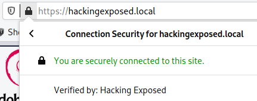
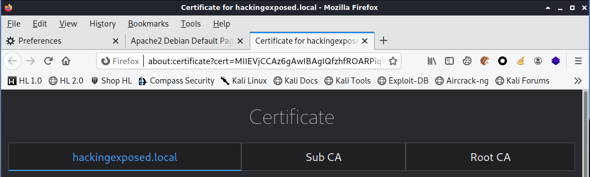

# Lab: Lokale Certificate Authority

-   Zeitaufwand:        ⏱️⏱️⏱️
-   Schwierigkeitsgrad: 🌶🌶🌶️
-   Beschreibung: In diesem Lab festigen Sie Ihr Verständnis des Aufbaus einer Certificate Authority respektive einer Chain of Trust, indem Sie eine eigene CA-Struktur aufbauen und in einem Webserver konfigurieren.

        Root CA
        └── Sub CA
            └── hackingexposed.local

## Voraussetzung & Vorbereitung

-   Kali Linux

## Aufgabe

1.  Öffnen Sie ein non-root Terminal (Alt + Enter) und führen Sie das Setup-Skript mit privilegierten Rechten aus `./setup.sh`. In Ihrem Home-Directory sollte nun ein neuer Ordner namens `/home/hacker/eduCA` erstellt worden sein. Ausserdem sollten Sie mit Firefox mit der URL `http://localhost` auf die Apache2 Defaultsite gelangen.

2.  Öffnen Sie mit Ihrem präferierten Editor die Datei `/etc/hosts` und fügen Sie die Zeile `127.0.0.1 hackingexposed.local` zusätzlich ein. Das Ergebnis könnte wie folgt aussehen:

        127.0.0.1       localhost
        127.0.1.1       hlkali.hacking-lab.com  hlkali
        127.0.0.1       hackingexposed.local

        # The following lines are desirable for IPv6 capable hosts
        ::1     localhost ip6-localhost ip6-loopback
        ff02::1 ip6-allnodes
        ff02::2 ip6-allrouters

    Verifizieren Sie die Korrektheit Ihres Eintrages mit einem Ping:

        ping -c 3 hackingexposed.local
        PING hackingexposed.local (127.0.0.1) 56(84) bytes of data.
        64 bytes from localhost (127.0.0.1): icmp_seq=1 ttl=64 time=0.062 ms
        64 bytes from localhost (127.0.0.1): icmp_seq=2 ttl=64 time=0.089 ms
        64 bytes from localhost (127.0.0.1): icmp_seq=3 ttl=64 time=0.080 ms

        --- hackingexposed.local ping statistics ---
        3 packets transmitted, 3 received, 0% packet loss, time 2041ms
        rtt min/avg/max/mdev = 0.062/0.077/0.089/0.011 ms

3.  Wechseln Sie nun mit `cd eduCA` in den neu erstellten Ordner. Das Verzeichnis sollte folgenden Inhalt aufweisen:

        tree
        .
        ├── certs
        ├── db
        │   ├── crlnumber
        │   ├── index
        │   └── serial
        ├── private
        └── server

        4 directories, 3 files

4.  Kopieren Sie die Dateien `res/root-ca.conf`, `ret/sub-ca.conf` in das Verzeichnis `eduCA` und `res/server.conf` in das Verzeichnis `eduCA/server`.

        tree
        .
        ├── certs
        ├── db
        │   ├── crlnumber
        │   ├── index
        │   └── serial
        ├── private
        ├── root-ca.conf
        ├── server
        │   └── server.conf
        └── sub-ca.conf

        4 directories, 6 files

5.  Erstellen Sie nun einen privaten Schlüssel für einen Webserver mit `openssl genpkey -out server/server.key -algorithm RSA -pkeyopt rsa_keygen_bits:2048 -aes-128-cbc`. Wählen Sie ein Passwort 𝕊 (für Server) für die PEM Datei.

6.  Erstellen Sie einen Certificate Signing Request (CSR) für diesen Key `openssl req -new -config server/server.conf -key server/server.key -out server/server.csr`.

7.  Erstellen Sie nun einen privaten Schlüssel für das Root Zertifikat mit `openssl req -new -config root-ca.conf -out root-ca.csr -keyout private/root-ca.key`. Wählen Sie ein Passwort ℝ (für Root) für die PEM Datei.

8.  Erstellen Sie ein Self-Signed Root Zertifikat mit `openssl ca -selfsign -config root-ca.conf -in root-ca.csr -out root-ca.crt -extensions ca_ext`. Überprüfen Sie den Inhalt unter _Issuer_, _Validity_ und _Subject_. Wenn alles in Ordnung ist, bestätigen Sie zwei Mal mit `y`.

9.  Erstellen Sie einen Sub-CA Schlüssel mit `openssl req -new -config sub-ca.conf -out sub-ca.csr -keyout private/sub-ca.key`. Wählen Sie ein Passwort 𝕀 (für Intermediate) für die PEM Datei.

10. Erstellen Sie ein Sub-CA Zertifikat mit `openssl ca -config root-ca.conf -in sub-ca.csr -out sub-ca.crt -extensions sub_ca_ext`. Überprüfen Sie den Inhalt unter _Issuer_, _Validity_ und _Subject_. Wenn alles in Ordnung ist, bestätigen Sie zwei Mal mit `y`.

11. Erstellen Sie nun anhand Ihres Server CSR aus Aufgabe 6 ein Server Zertifikat mit `openssl ca -config sub-ca.conf -in server/server.csr -out server/server.crt -extensions server_ext`. Überprüfen Sie den Inhalt unter _Issuer_, _Validity_ und _Subject_. Wenn alles in Ordnung ist, bestätigen Sie zwei Mal mit `y`.

    Die Ordnerstruktur sollte wie folgt aussehen:

        tree
        .
        ├── certs
        │   ├── 7F385F44E0113E2A850573549ED153A6.pem
        │   ├── 7F385F44E0113E2A850573549ED153A7.pem
        │   └── 7F385F44E0113E2A850573549ED153A8.pem
        ├── db
        │   ├── crlnumber
        │   ├── index
        │   ├── index.attr
        │   ├── index.attr.old
        │   ├── index.old
        │   ├── serial
        │   └── serial.old
        ├── private
        │   ├── root-ca.key
        │   └── sub-ca.key
        ├── root-ca.conf
        ├── root-ca.crt
        ├── root-ca.csr
        ├── server
        │   ├── server.conf
        │   ├── server.crt
        │   ├── server.csr
        │   └── server.key
        ├── sub-ca.conf
        ├── sub-ca.crt
        └── sub-ca.csr

        4 directories, 22 files

12. Importieren Sie nun das Root Zertifikat `root-ca.crt` in den Trusted Store von Firefox (Preferences > Privacy & Security > View Certificates > Authorities > Import). Achten Sie darauf, dass Sie _Trust this CA to identify websites_ setzen.

13. Erstellen Sie mit root Rechten unter `/etc/apache2/sites-enabled/` eine Datei mit dem Namen `hackingexposed.ch.conf` und kopieren Sie den Inhalt aus `res/hackingexposed.ch.conf` in diese Datei.
    Alternative können Sie die Datei auch mit diesem Befehl kopieren `sudo cp res/hackingexposed.ch.conf /etc/apache2/sites-enabled/`.

14. Starten Sie Apache2 mittels `sudo systemctl restart apache2.service` neu. Prüfen Sie mit dem Status-Befehl `sudo systemctl status apache2.service`, dass der Service sauber läuft.

15. Öffnen Sie nun mit Firefox die Webseite `https://hackingexposed.local`. Sie sollten die Apache2 Default-Site über einen TLS verschlüsselten Kanal sehen. Prüfen Sie das Zertifikat und die Trust-Chain.

    

    

16. Nachdem Sie alle Fragen beantwortet haben, können Sie mit dem Skript `sudo clean-up.sh` Ihre Konfiguration rückgängig machen.

## Fragen

Alle Antworten per [Mail](mailto:pascal.knecht@juventus.schule?subject=[Lab]%20Lokale%20Certificate%20Authority) mit Betreff `[Lab] Lokale Certificate Authority` an den Dozenten.

1.  Welche Passwörter (ℝ _root_ und 𝕀 _intermediate_ und 𝕊 _server_) mussten Sie zur Entschlüsselung der privaten Schlüssel in Aufgabe 8, 10, 11 und 14 verwenden? Gesucht ist die korrekte Reihenfolge der Mengensymbole.

2.  Am Ende von Aufgabe 15 sehen Sie drei Zertifikate. Welche dieser Zertifikate wurden beim TLS-Verbindungsaufbau vom Server an den Client übermittelt?

3.  Beweisen Sie Ihre Antwort auf Frage 2 anhand des Tools OpenSSL `s_client`. Es gibt mehrere Möglichkeiten, beschreiben Sie Ihr Vorgehen mit den Befehlen und/oder Screenshots.

## Bemerkungen

-   Die CA Befehle und Konfigurationsdateien basieren auf dem Buch _OpenSSL Cookbook - The Definitive Guide to the Most Useful Command Line Features_ von [Ivan Ristić](https://blog.ivanristic.com/), Februar 2021. Das Buch kann über den [Feisty Duck](https://www.feistyduck.com/books/openssl-cookbook/) Verlag DRM-frei und gratis heruntergeladen werden.

-   Für Frage 2 und 3 könnte Ihnen der Parameter `-keylogfile` vielleicht weiterhelfen.
