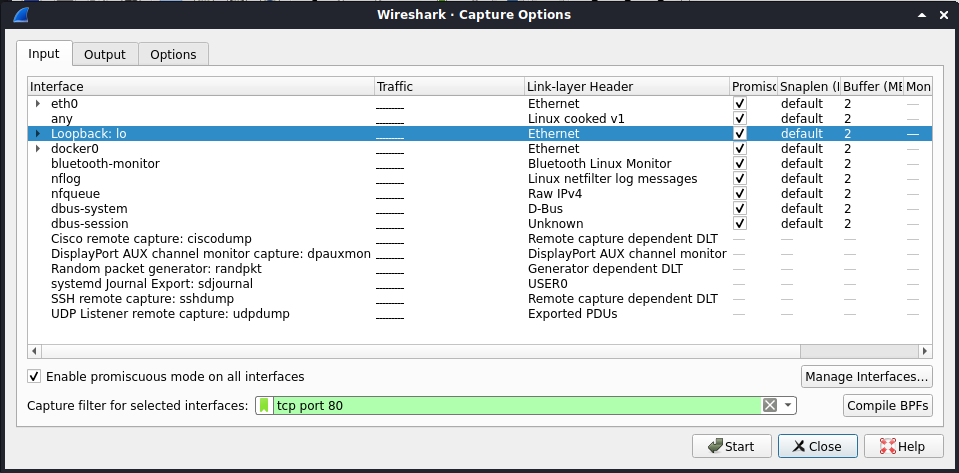
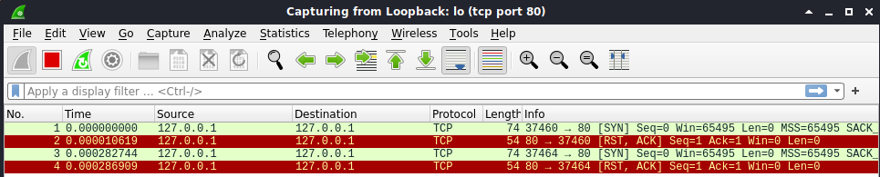
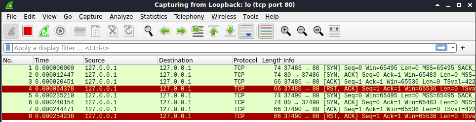
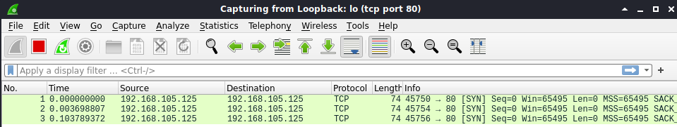
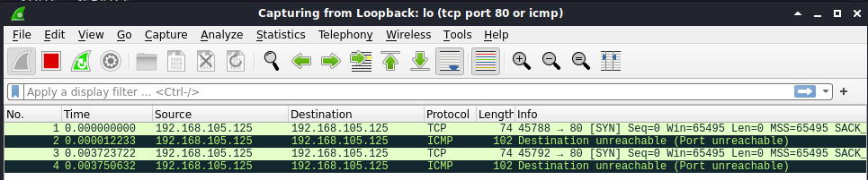

# Lab: Nmap Basics

-   Zeitaufwand:        ⏱️⏱️
-   Schwierigkeitsgrad: 🌶️🌶️
-   Beschreibung: In diesem Lab vertiefen Sie Ihr Wissen über Betriebssystemsockets, Nmap und wiederholen einige Aspekte von Iptables.

## Voraussetzung & Vorbereitung

-   Kali Linux

## Aufgabe

1.  Öffnen Sie ein non-root Terminal (Alt + Enter) und geben Sie folgenden Befehl ein: `nmap scanme.nmap.org`. Die Ausgabe sollte wie folgt aussehen:

        nmap scanme.nmap.org
        Starting Nmap 7.91 ( https://nmap.org ) at 2021-02-06 18:45 CET
        Nmap scan report for scanme.nmap.org (45.33.32.156)
        Host is up (0.20s latency).
        Other addresses for scanme.nmap.org (not scanned): 2600:3c01::f03c:91ff:fe18:bb2f
        Not shown: 996 closed ports
        PORT      STATE SERVICE
        22/tcp    open  ssh
        80/tcp    open  http
        9929/tcp  open  nping-echo
        31337/tcp open  Elite

        Nmap done: 1 IP address (1 host up) scanned in 17.17 seconds

    Der Host `scanme.nmap.org` hat die IPv4 Adresse `45.33.32.156` und die IPv6 Adresse `2600:3c01::f03c:91ff:fe18:bb2f`. Insgesamt wurden 1000 Ports gescannt, wovon die vier Ports _22_, _80_, _9929_ und _31337_ offen sind, alle anderen Ports sind geschlossen.

2.  Starten Sie nun Wireshark, wählen Sie das Capture Interface `Loopback: lo` aus und setzen Sie den Capture Filter auf `tcp port 80 or icmp`. Starten Sie die Aufzeichnung mit Enter/Eingabe.

    

3.  Scannen Sie mit Nmap nun Ihr Kali System explizit auf Port 80/tcp mit dem Befehl: `nmap localhost -p 80`. Die Ausgabe im Terminal sollte wie folgt aussehen:

        nmap localhost -p 80
        Starting Nmap 7.91 ( https://nmap.org ) at 2021-02-06 19:04 CET
        Nmap scan report for localhost (127.0.0.1)
        Host is up (0.00013s latency).
        Other addresses for localhost (not scanned): ::1

        PORT   STATE  SERVICE
        80/tcp closed http

        Nmap done: 1 IP address (1 host up) scanned in 0.06 seconds

    Die Ausgabe in Wireshark sollte wie folgt aussehen:

    

    Mit dem Befehl `sudo netstat -tlpn` werden alle Prozesse und deren registriete Sockets angezeigt. Im Moment sollte diese Anzeige leer sein:

        sudo netstat -tlpn
        Active Internet connections (only servers)
        Proto Recv-Q Send-Q Local Address           Foreign Address         State       PID/Program name

4.  Starten Sie nun den Apache2 Webserver mit dem Befehl `sudo systemctl start apache2.service` und vergewissern Sie sich, dass der Service läuft `sudo systemctl status apache2.service`.

    Nun sollte Apache2 den Port 80 auf allen Interfaces registriert haben `sudo netstat -tlpn`:

        sudo netstat -tlpn
        Active Internet connections (only servers)
        Proto Recv-Q Send-Q Local Address           Foreign Address         State       PID/Program name    
        tcp6       0      0 :::80                   :::*                    LISTEN      11147/apache2

5.  Scannen Sie Ihr Kali System erneut mit `nmap localhost -p 80`. Die Ausgabe im Terminal sollte wie folgt aussehen:

        nmap localhost -p 80
        Starting Nmap 7.91 ( https://nmap.org ) at 2021-02-06 19:13 CET
        Nmap scan report for localhost (127.0.0.1)
        Host is up (0.000091s latency).
        Other addresses for localhost (not scanned): ::1

        PORT   STATE SERVICE
        80/tcp open  http

        Nmap done: 1 IP address (1 host up) scanned in 0.05 seconds

    Die Ausgabe in Wireshark sollte wie folgt aussehen:

    

6.  Apache2 hat den Port 80 beim Betriebssystem auf allen Interfaces registriert. Das können Sie verifizieren, wenn Sie mit `nmap 192.168.23.42 -p 80` Ihre DHCP IP Adresse scannen. Der Port 80 sollte von Nmap als offen erkannt werden.

7.  Fügen Sie nun folgende Iptables DROP-Regel ein: `sudo iptables -A INPUT -p TCP -d 192.168.23.23 --dport 80 -j DROP`. Führen Sie nun erneut einen Scan auf Port 80 aus.

    Nmap ergibt folgende Ausgabe:

        nmap 192.168.105.125 -p 80
        Starting Nmap 7.91 ( https://nmap.org ) at 2021-02-06 20:49 CET
        Nmap scan report for hlkali.home (192.168.105.125)
        Host is up (0.000030s latency).

        PORT   STATE    SERVICE
        80/tcp filtered http

        Nmap done: 1 IP address (1 host up) scanned in 0.26 seconds

    Wireshark sieht wie folgt aus:

    

8.  Ändern Sie nun die Iptables Regel ab, sodass statt einer DROP-Action eine REJECT-Action angewendet wird: `sudo iptables -R INPUT 1 -p TCP -d 192.168.105.125 --dport 80 -j REJECT` und scannen Sie Ihre Kali Instanz erneut auf Port 80.

    Nmap ergibt folgende Ausgabe:

        nmap 192.168.105.125 -p 80
        Starting Nmap 7.91 ( https://nmap.org ) at 2021-02-06 21:02 CET
        Nmap scan report for hlkali.home (192.168.105.125)
        Host is up (0.00010s latency).

        PORT   STATE  SERVICE
        80/tcp closed http

        Nmap done: 1 IP address (1 host up) scanned in 0.06 seconds

    Wireshark sieht wie folgt aus:

    

## Fragen

Alle Antworten per [Mail](mailto:pascal.knecht@juventus.schule?subject=[Lab]%20Nmap%20Basics) mit Betreff `[Lab] Nmap Basics` an den Dozenten.

1.  Nach Aufgabe 3 zeigt Nmap den Port 80 als geschlossen ('closed') an. Wieso?

2.  Nach Aufgabe 7 zeigt Nmap den Port als gefiltert ('filtered') an. Wieso?

3.  Nach Aufgabe 8 zeigt Nmap den Port als geschlossen ('closed') an. Begründen Sie.

## Bemerkungen

-   Sie sollten keine Server/Systeme im Internet scannen, die nicht Ihnen gehören oder für die Sie nicht eine explizite Erlaubnis zum Scannen besitzen. Wenn Sie weiter mit Nmap experiementieren möchten, verwenden Sie jeweils `scanme.nmap.org`.

-   Es ist auch nicht empfehlenswert, wenn Sie Nmap Scans in und aus Ihrem Firmennetz machen.

## Clean-up

Führen Sie im root-terminal das Skript `clean-up.sh` mit dem Befehl `./clean-up.sh` aus, um Ihre Umgebung zurückzusetzen.

Falls Sie die Fehlermeldung `bash: ./clean-up: Permission denied` erhalten, müssen Sie das Skript erst ausführbar machen: `chmod u+x clean-up.sh`.
