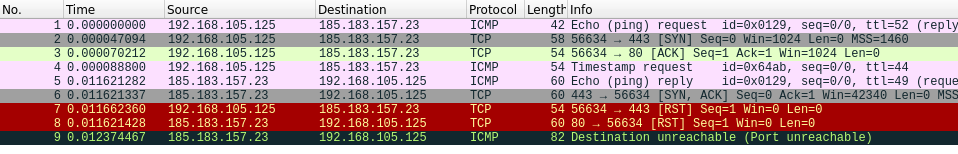
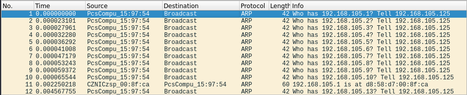

# Lab: Nmap Host Discovery

-   Zeitaufwand:        ⏱️
-   Schwierigkeitsgrad: 🌶️🌶️
-   Beschreibung: In diesem Lab prüfen und festigen Sie Ihr Verständnis zum Thema Host Discovery mit Nmap.

## Voraussetzung & Vorbereitung

-   Kali Linux mit Network Bridge Adapter Modus

## Aufgabe

In der Vorlesung wurden die verschiedenen Host Discovery Techniken von Nmap behandelt. Wenn Sie keine spezifische Technik als Argument übergeben, verwendet Nmap die vier verschiedenen Techniken ICMP Echo Request, TCP SYN Paket (443) TCP ACK Paket (80) und ICMP Timestamp. Verifizieren Sie diese Aussage mit Nmap und Wireshark und dem Host www.hackingexposed.ch.

1.  Öffnen Sie Wireshark und setzen Sie den Capture Filter `host hackingexposed.ch`.

2.  Öffnen Sie ein non-root Terminal (Alt + Enter) und geben Sie folgenden Befehl ein: `sudo nmap -sn hackingexposed.ch`. Die Ausgabe sollte wie folgt aussehen:

        sudo nmap -sn hackingexposed.ch
        Starting Nmap 7.91 ( https://nmap.org ) at 2021-02-11 16:30 CET
        Nmap scan report for hackingexposed.ch (185.183.157.23)
        Host is up (0.011s latency).
        Other addresses for hackingexposed.ch (not scanned): 2a03:4000:1d:68e::23
        rDNS record for 185.183.157.23: ramses3.addere.ch
        Nmap done: 1 IP address (1 host up) scanned in 0.47 seconds

    

3.  Mit `ip addr show eth0` finden Sie Ihre aktuelle IP- und Subnetzadresse heraus. In diesem Beispiel ist die IP der Kali-Instanz `192.168.105.125/24`. Starten Sie einen neuen Wireshark-Mitschnitt mit dem Capture Filter `net 192.168.105.0/24`, also auf die Netzadresse Ihres lokalen Netzes.

4.  Starten Sie nun einen Netzwerkscan mittels `sudo nmap 192.168.105.0/24`. Die Ausgabe könnte wie folgt aussehen:

        sudo nmap -sn 192.168.105.0/24
        Starting Nmap 7.91 ( https://nmap.org ) at 2021-02-11 18:12 CET
        Nmap scan report for 192.168.105.1
        Host is up (0.0025s latency).
        MAC Address: D8:58:D7:00:8F:CA (CZ.NIC, z.s.p.o.)

        ---8< gekürzt 8<---

        Nmap scan report for hlkali.home (192.168.105.125)
        Host is up.
        Nmap done: 256 IP addresses (10 hosts up) scanned in 1.88 seconds

    Die Ausgabe in Wireshark sollte in etwa so aussehen:

    

    Mit dem Display Filter `arp.dst.proto_ipv4 == 192.168.105.23` wird die Paketanzeige auf zwei Pakete reduziert.

## Fragen

Alle Antworten per [Mail](mailto:pascal.knecht@juventus.schule?subject=[Lab]%20Nmap%20Host%20Discovery) mit Betreff `[Lab] Nmap Host Discovery` an den Dozenten.

1.  Wieso nutzt Nmap vier verschiedene Paket-Typen und Scans um festzustellen, ob ein Remote-Host online/erreichbar ist?

2.  Wieso nutzt Nmap für ein Host Discovery im lokalen Netzwerk (Aufgabe 4) andere Pakete als für ein Host Discovery eines Rechners im Internet (Aufgabe 2)?

3.  Welches Protokoll haben die beiden Pakete, die am Schluss von Aufgabe 4 angezeigt werden? Welche Destination Adresse haben die beiden Protokolle?

## Bemerkungen

-   Sie sollten keine Server/Systeme im Internet scannen, die nicht Ihnen gehören oder für die Sie keine explizite Erlaubnis zum Scannen besitzen. Wenn Sie weiter mit Nmap experiementieren möchten, verwenden Sie jeweils `scanme.nmap.org`.

-   Es ist auch nicht empfehlenswert, wenn Sie Nmap Scans in und aus Ihrem Firmennetz machen.
