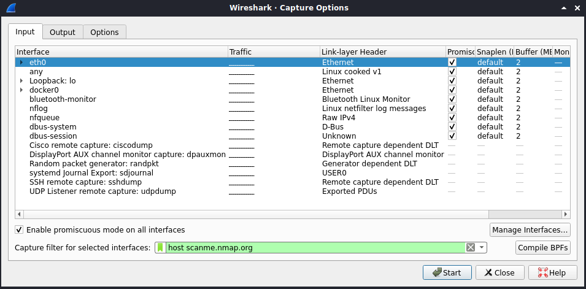
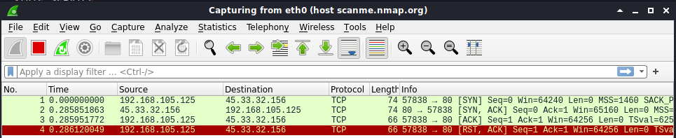
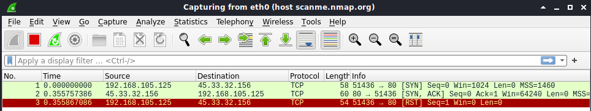

# Lab: Nmap SYN- und Connect Scan

-   Zeitaufwand:        ⏱️
-   Schwierigkeitsgrad: 🌶️
-   Beschreibung: In diesem Lab vertiefen Sie Ihr Wissen zu Nmap, indem Sie verschiedene Scan-Techniken untersuchen.

## Voraussetzung & Vorbereitung

-   Kali Linux

## Aufgabe

1.  Starten Sie Wireshark und wählen Sie auf dem Interface eth0 den Capture Filter `host scanme.nmap.org`.

    

2.  Führen Sie einen Port Scan auf Port 80 des Hosts `scanme.nmap.org` durch. Die Ausgabe sollte wie folgt aussehen:

        nmap scanme.nmap.org -p 80
        Starting Nmap 7.91 ( https://nmap.org ) at 2021-02-06 21:34 CET
        Nmap scan report for scanme.nmap.org (45.33.32.156)
        Host is up (0.39s latency).
        Other addresses for scanme.nmap.org (not scanned): 2600:3c01::f03c:91ff:fe18:bb2f

        PORT   STATE SERVICE
        80/tcp open  http

        Nmap done: 1 IP address (1 host up) scanned in 0.85 seconds

    Die Ausgabe in Wireshark sollte wie folgt aussehen:

    

    Obwohl Sie nur Port 80 spezifiziert haben, erscheinen in diesem Netzwerkmitschnitt drei SYN-Pakete, zwei Mal auf Port 80 (#1 und #7) und ein Mal auf Port 443 (#2). Das liegt an der Host Discovery Funktion, die Nmap standardmässig vor jedem Scan durchführt. Diese können Sie mit dem Parameter `-Pn` unterdrücken. Entsprechend sehen Sie nun nur noch die erwarteten Pakete:

    

3.  Wird Nmap ohne privilegierte Rechte (also nicht als root User) und ohne andere Parameter ausgeführt, wird _TCP Connect Scan_ verwendet. Dieser Scan Typ kann auch mit dem Parameter `-sT` konfiguriert werden. Entsprechend führen die beiden Befehle `nmap scanme.nmap.org -p 80 -Pn` und `nmap scanme.nmap.org -p 80 -Pn -sT` zu demselben Ergebnis.

4.  Führen Sie nun mit root Rechten einen _SYN Scan_ (`-sS`) durch: `sudo nmap scanme.nmap.org -p 80 -Pn -sS`.

    

    Bei diesem Scan Typ greift Nmap nicht auf die Verbindungsaufbau-Dienste des Betriebssystems zurück, sondern baut das SYN-Paket selbstständig zusammen und schickt dieses ohne Zutun des Betriebssystems an die Ziel-IP. So kann der TCP Three-Way Handshake umgangen werden.

## Fragen

Alle Antworten per [Mail](mailto:pascal.knecht@juventus.schule?subject=[Lab]%20Nmap%20SYN%20und%20Connect%20Scan) mit Betreff `[Lab] Nmap SYN und Connect Scan` an den Dozenten.

1.  Was ist die Idee der Host Discovery in Nmap?

2.  Wie viele Pakete werden von wem mit dem _TCP Connect Scan_ `-sT` und wie viele mit dem _SYN Scan_ `-sS` über das Netzwerk geschickt?

3.  Was ist ein Einsatzszenario für den _TCP Connect Scan_ und was für den _SYN Scan_?
