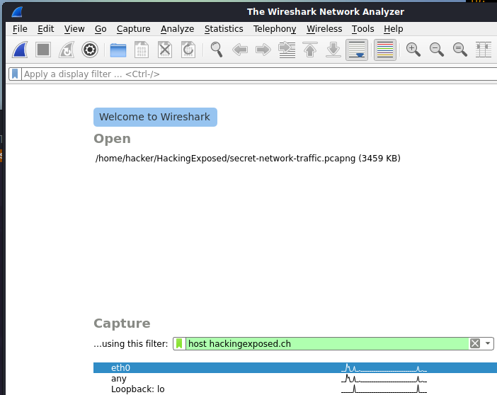
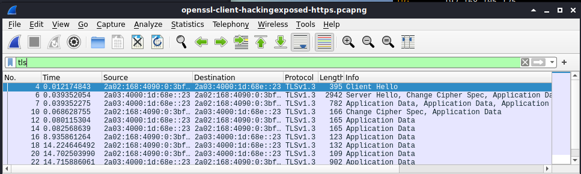

# Lab: TLS Client

-   Zeitaufwand:        ⏱️
-   Schwierigkeitsgrad: 🌶
-   Beschreibung: In diesem Lab analysieren Sie eine verschlüsselte Verbindung mit Wireshark und nutzen das OpenSSL Tool `s_client` zum Aufbau von TLS Verbindungen.

## Voraussetzung & Vorbereitung

-   Kali Linux

## Aufgabe

1.  Öffnen Sie Wireshark und setzen Sie den Capture Filter auf `host hackingexposed.ch` wie im Screenshot beschrieben. Starten Sie den Packet Capture.

    

2.  Öffnen Sie ein non-root Terminal (Alt + Enter) und führen Sie den Befehl `openssl s_client -connect hackingexposed.ch:443` aus.

        openssl s_client -connect hackingexposed.ch:443
        CONNECTED(00000003)
        depth=2 O = Digital Signature Trust Co., CN = DST Root CA X3
        verify return:1
        depth=1 C = US, O = Let's Encrypt, CN = R3
        verify return:1
        depth=0 CN = hackingexposed.ch
        verify return:1
        ---
        Certificate chain
         0 s:CN = hackingexposed.ch
           i:C = US, O = Let's Encrypt, CN = R3
         1 s:C = US, O = Let's Encrypt, CN = R3
           i:O = Digital Signature Trust Co., CN = DST Root CA X3
        ---
        Server certificate
        -----BEGIN CERTIFICATE-----
        MIIGPjCCBSagAwIBAgISBOu4ifwN0dsCjgOpUN4e9H3oMA0GCSqGSIb3DQEBCwUA

        ---8< gekürzt 8<---

        ZjPd+NhsNWOWKUkfV47jwPPXODGt39z6REPc2XeEqZ105YfYhnznxsqI1KXDKkTM
        GuluqYQ4upn031/Hm7JYiV1q
        -----END CERTIFICATE-----
        subject=CN = hackingexposed.ch

        issuer=C = US, O = Let's Encrypt, CN = R3

        ---
        No client certificate CA names sent
        Peer signing digest: SHA256
        Peer signature type: RSA-PSS
        Server Temp Key: X25519, 253 bits
        ---
        SSL handshake has read 3552 bytes and written 389 bytes
        Verification: OK

      Der erste Teil dreht sich um die Vertrauenskette (Chain of Trust) mit den Zertifikaten und um die Authentizität des TLS-Handshakes.

      Es folgt eine Zusammenfassung der ausgehandelten TLS Version und des verwendeten Ciphers:

        ---
        New, TLSv1.3, Cipher is TLS_AES_256_GCM_SHA384
        Server public key is 4096 bit
        Secure Renegotiation IS NOT supported
        Compression: NONE
        Expansion: NONE
        No ALPN negotiated
        Early data was not sent
        Verify return code: 0 (ok)
        ---

    Ab diesem Zeitpunkt verhält sich das Terminal ähnlich wie in einer Telnet oder NetCat Session. Im Klartext können Sie nun HTTP "sprechen" und zum Beispiel den Request auf das Index File absetzen. Als Antwort erhalten Sie den Inhalt der Webseite.

        GET / HTTP/1.1
        Host: hackingexposed.ch

        HTTP/1.1 200 OK
        Server: nginx/1.18.0 (Ubuntu)
        Date: Tue, 23 Mar 2021 20:27:47 GMT
        Content-Type: text/html
        Content-Length: 502
        Last-Modified: Thu, 11 Feb 2021 14:41:58 GMT
        Connection: keep-alive
        ETag: "60254236-1f6"
        Strict-Transport-Security: max-age=63072000
        Accept-Ranges: bytes

        <!doctype html>
        <html lang="en">
        <head>
          <meta charset="utf-8">
          <title>hackingexposed.ch</title>
          <meta name="description" content="Personel website">
          <meta name="author" content="Pascal K.">
          <link rel="stylesheet" href="css/styles.css?v=1.0">
          <link rel="icon" href="data:image/svg+xml,<svg xmlns=%22http://www.w3.org/2000/svg%22 viewBox=%220 0 100 100%22><text y=%22.9em%22 font-size=%2290%22>☕</text></svg>">
        </head>
        <body>
          <h1>hackingexposed.ch</h1>
          
Demo site

        </body>
        </html>
        ^C

      Beenden Sie die TLS Session mit `Ctrl + c`.

3.  Wireshark Mittschnitt könnte wie folgt aussehen:

    

## Fragen

Alle Antworten per [Mail](mailto:pascal.knecht@juventus.schule?subject=[Lab]%20TLS%20Client) mit Betreff `[Lab] TLS Client` an den Dozenten.

1.  Welche TLS Version und welcher Cipher wurde ausgehandelt?

2.  In obiger Ausgabe wird ein Zertifikat angezeigt. Sehen Sie dieses auch in Wireshark? Begründen Sie Ihre Antwort.

3.  Nennen Sie den CommonName (CN) des Root Zertifikates dieser Verbindung.

## Bemerkungen

-   OpenSSL bietet eine Vielzahl von Tools nebst `s_client` an. Beispielsweise die Serverkomponente wird mit `s_server` gestartet. Damit lässt sich lokal im Terminal eine TLS-Server Instanz betreiben.
